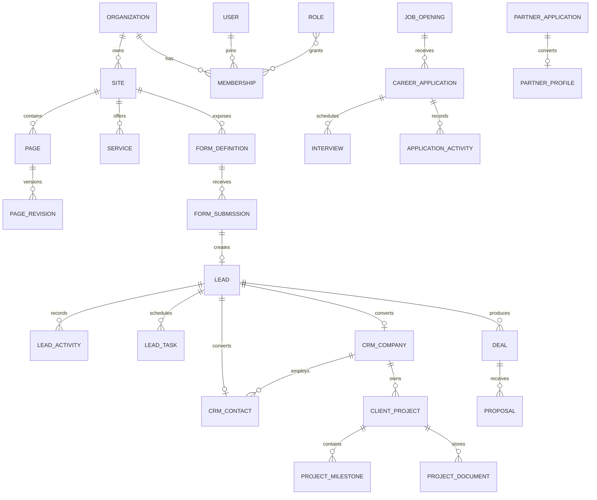

# Complete Model Catalogue

## 1. Identity, access and tenancy

| Model | Stores | Main references |
|---|---|---|
| Organization | Tenant/company profile and platform configuration | Parent of sites, memberships, leads and integrations |
| Site | Domain, branding, locale and public contact configuration | Organization, MediaAsset |
| SiteSetting | SEO, tracking, lead-capture and social settings | Site, Page, User, NotificationTemplate |
| User | Authentication identity and profile | Used by Membership and operational entities |
| Role | Permission bundle | Organization |
| Membership | User access inside an organization | User, Organization, Role |
| RefreshSession | Rotating authenticated sessions | User |
| AuthToken | Verification, invitation and password-reset tokens | User, Organization |

## 2. Website CMS and content

| Model | Stores | Main references |
|---|---|---|
| Page | Page identity and publication state | Site, PageRevision, User |
| PageRevision | Versioned Figma-compatible sections and SEO | Page, ReusableBlock, MediaAsset |
| ReusableBlock | Shared CTA, banner or structured component content | Site, User |
| NavigationMenu | Header, footer and other menu trees | Site, Page |
| ServiceCategory | Editable service grouping | Site, MediaAsset |
| Service | MarkGenex service content | Site, ServiceCategory, Page, MediaAsset |
| BlogCategory | Editable blog grouping | Site |
| BlogPost | Blog article, author, category, tags and SEO | Site, BlogCategory, User, MediaAsset |
| CaseStudy | Client challenge, solution, results and metrics | Site, Industry, Service, MediaAsset |
| Industry | Industry-specific marketing pages | Site, Page, Service |
| TeamMember | Public team and leadership profile | Site, User, MediaAsset |
| Testimonial | Text or video client review | Site, Service, CaseStudy, MediaAsset |
| FAQ | Reusable questions and answers | Site, Page, Service |
| OfficeLocation | Offices, maps and working hours | Site |
| RedirectRule | SEO and URL redirects | Site |

## 3. Media

| Model | Stores | Main references |
|---|---|---|
| MediaFolder | Admin media-library hierarchy | Site, parent MediaFolder |
| MediaAsset | Image, video, document and file metadata | Organization, Site, MediaFolder, User |

## 4. Forms and lead capture

| Model | Stores | Main references |
|---|---|---|
| FormDefinition | Dynamic form fields, rules and destinations | Site, User |
| FormSubmission | Original immutable-ish submitted payload and UTM data | Site, FormDefinition, Lead |
| ContactEnquiry | Contact-page message and response state | Submission, Lead, Service, User |
| ConsultationBooking | Requested consultation schedule | Lead, Service, User |
| Campaign | Marketing campaign, budget and channel metadata | Organization, Site, User |
| ConversionGoal | Internal and advertising-platform conversion definition | Site, User |

## 5. Lead management and CRM

| Model | Stores | Main references |
|---|---|---|
| Lead | Normalized sales lead, attribution, qualification and assignment | Submission, Campaign, Service, User, CRM entities |
| LeadActivity | Append-style calls, notes, messages and history | Lead, User |
| LeadTask | Follow-up work and reminders | Lead, User |
| LeadAssignmentRule | Fixed, round-robin and workload-based assignment rules | Site, User, Role |
| PipelineStage | Configurable stages and probabilities | Organization |
| CrmCompany | Normalized prospect or client company | Industry, Lead, User |
| CrmContact | Normalized business contact | CrmCompany, Lead, User |
| Deal | Sales opportunity and forecast | Lead, Company, Contact, PipelineStage, Campaign |
| Proposal | Scope, pricing, PDF reference and acceptance state | Lead, Deal, Company, Contact, Service |

## 6. Careers

| Model | Stores | Main references |
|---|---|---|
| JobOpening | Vacancy content and publishing data | Site, User, MediaAsset |
| CareerApplication | Candidate data, CV and hiring status | JobOpening, User, MediaAsset |
| Interview | Interview rounds, schedules, interviewers and feedback | CareerApplication, User |
| ApplicationActivity | Hiring timeline and communication history | CareerApplication, User, MediaAsset |
| EmployeeProfile | Future employee portal profile | User, Organization, OfficeLocation |

## 7. Partnerships and future portals

| Model | Stores | Main references |
|---|---|---|
| PartnerApplication | University, admission and business partner request | Site, User, MediaAsset |
| PartnerProfile | Approved partner account and agreement details | Organization, Application, User, Service |
| ClientProfile | Future client portal access | User, CrmCompany, CrmContact |
| ClientProject | Client work, team, budget and progress | CrmCompany, Deal, Service, User |
| ProjectMilestone | Project phases and deliverables | ClientProject, User, MediaAsset |
| ProjectDocument | Access-controlled project documents | ClientProject, Milestone, MediaAsset |

## 8. Notifications and integrations

| Model | Stores | Main references |
|---|---|---|
| NotificationTemplate | Reusable email, SMS and WhatsApp content | Organization, Site |
| NotificationDelivery | Provider delivery state and retries | Template and business entity |
| UserNotification | Admin and portal in-app notification | User, Organization |
| IntegrationSetting | Encrypted provider configuration | Organization, Site |
| CrmSyncLog | CRM synchronization attempts and external IDs | IntegrationSetting and business entity |
| WebhookEndpoint | Outbound webhook subscription | Organization, User |
| WebhookDelivery | Signed event delivery, retries and response | WebhookEndpoint |

## 9. Analytics, reporting and governance

| Model | Stores | Main references |
|---|---|---|
| AnalyticsEvent | Event-level page, session, campaign and conversion data | Site, Lead, Campaign, Page, User |
| DailyMetric | Aggregated traffic, lead, campaign, sales and career reporting | Organization, Site |
| ConsentLog | Append-only privacy and marketing consent history | Any data subject |
| AuditLog | Append-only administrative action history | Organization, User and any entity |
| DataExportJob | Permission-controlled asynchronous exports | Organization, User, MediaAsset |

## Main relationships

## Data that stays embedded

Small and bounded value objects remain embedded instead of becoming separate collections:

- Addresses
- SEO metadata
- UTM attribution
- Consent snapshot submitted with a form
- Budget and currency values
- Social links
- Page-section props
- Proposal line items
- Working hours
- Device and geographic analytics metadata

This avoids unnecessary joins while dedicated collections handle independently managed or unbounded data.
